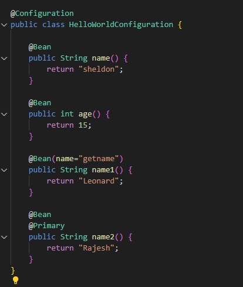

@Configuration 

This annotation is used to tell spring that this is a configuration class and you can access beans in this class by following way:

@Bean configuration tells spring to manage these ojbect.

There are multiple ways you can get spring beans from context. Few ways are:

@Primary
If there are multiple beans returning the same data type then method with this annotation gets called

If you want to call beans to create another bean, then you can do this by calling name of this function/given name in annotation. Or you can pass these as a parameter to function.
Or you can declare @Qualifier annotaion and call that as a parameter.
